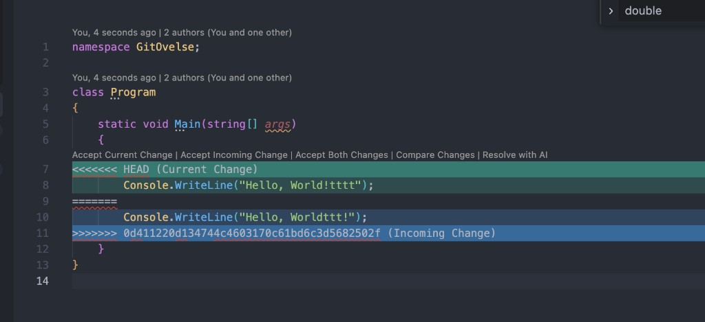

# Aflevering

Et screenshot eller en kort beskrivelse af konflikten, samt en mundtlig forklaring af, hvad de tre markører (`<<<<<<<`, `=======`, `>>>>>>>`) betyder.

## Screenshot

## Kort beskrivelse

I `Program.cs` opstod der en merge-konflikt i `Main`. Min lokale version (`HEAD`) skrev `Hello, World!tttt`, mens den indkommende commit skrev `Hello, Worldttt!`. Git kunne ikke selv vælge, hvilken linje der skulle beholdes.

## Mundtlig forklaring af markørerne

Når Git ikke kan slå to ændringer sammen automatisk, sætter den tre markører ind i filen, så man kan se, hvor konflikten er, og hvad de to sider vil.

`<<<<<<<` betyder: her starter min nuværende version. Alt mellem den linje og `=======` er det, der ligger i den branch, jeg står på lige nu — altså `HEAD`. I dette tilfælde er det `Console.WriteLine("Hello, World!tttt");`.

`=======` er skillelinjen midt i konflikten. Den deler de to forslag. Over stregen er min ændring. Under stregen er den ændring, der kommer ind udefra.

`>>>>>>>` betyder: her slutter den indkommende version. Alt mellem `=======` og den linje er koden fra den anden commit — her `Hello, Worldttt!`. Når konflikten er løst, skal alle tre markører fjernes, så filen kun indeholder den kode, man har valgt at beholde.
